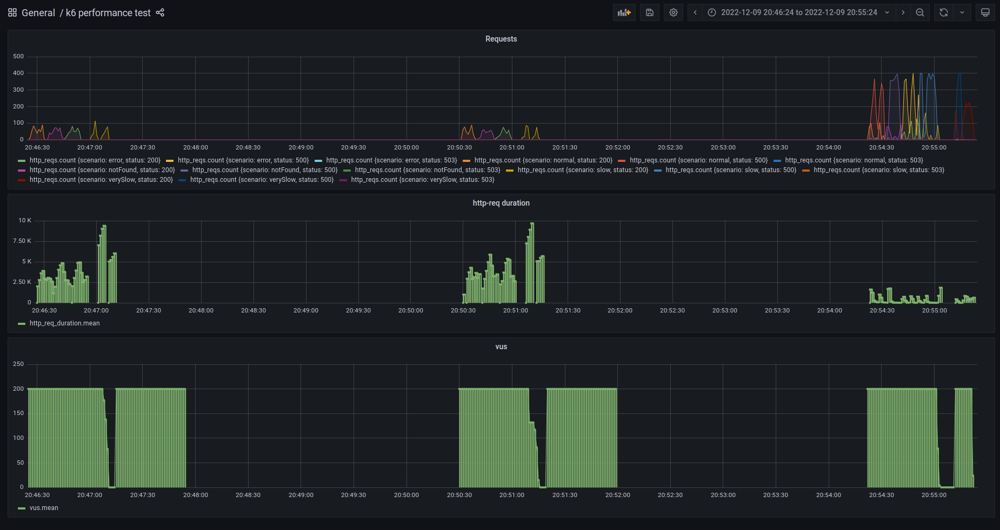
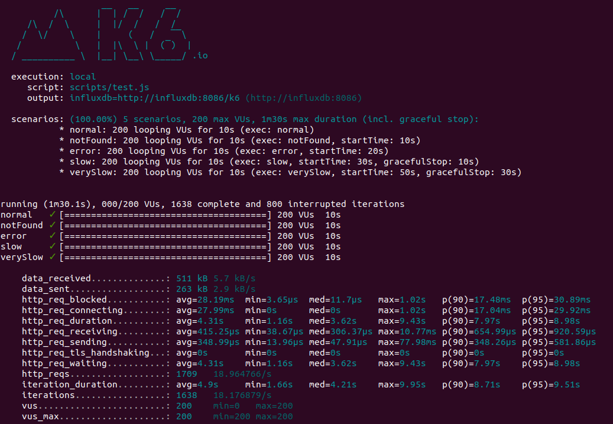
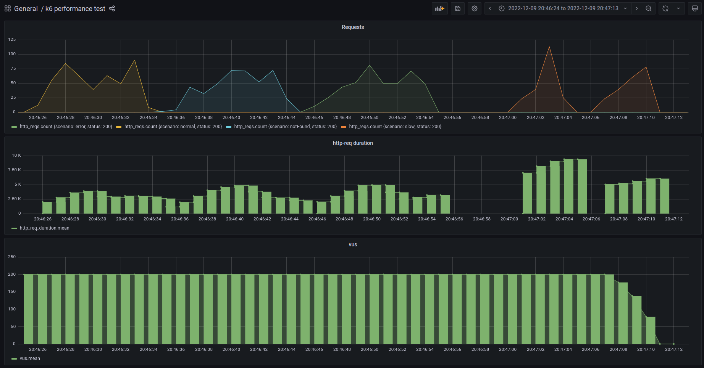
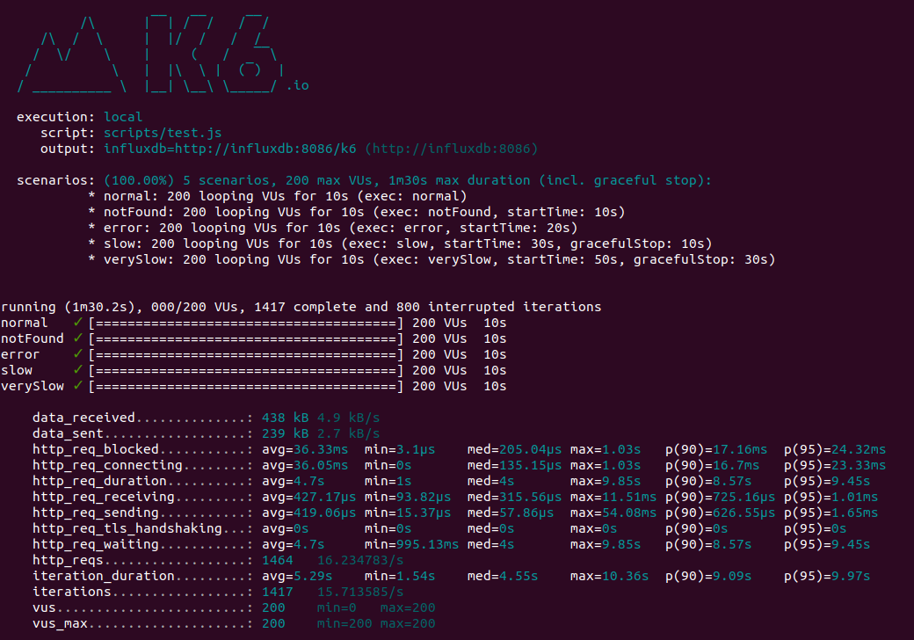
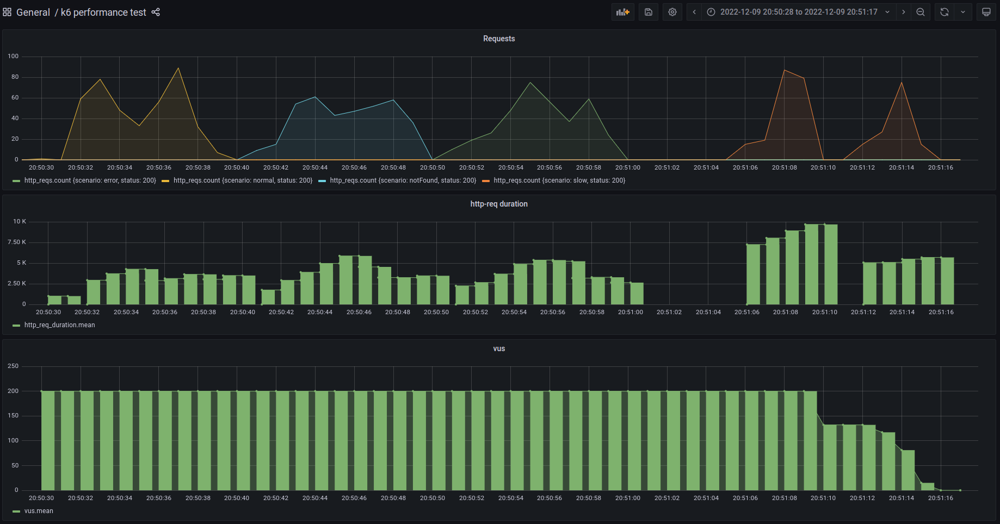
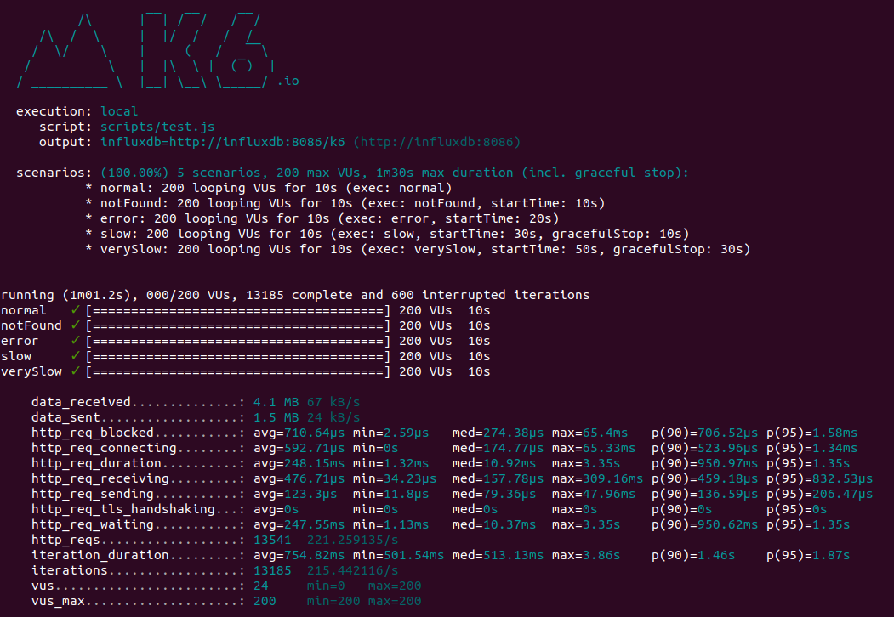
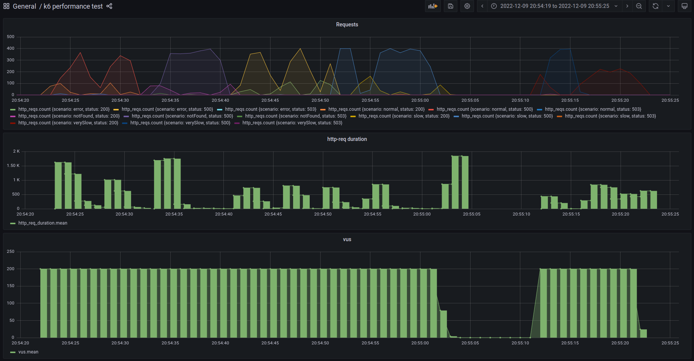

# Development notes

The original readme was renamed
to [README]{https://github.com/ferdonof/backendDevTest/blob/resilience4j-approach/readme_original.md}

For this project I developed a spring boot application and the solution uses different approaches, each one in different
branches.
The original repository files remains in main branch.
I created a [development]{https://github.com/ferdonof/backendDevTest/tree/development} branch with default values of the
server for request
time a read time.
Development branch was forked in two additional branches.
The [feign-approach]{https://github.com/ferdonof/backendDevTest/tree/feign-approach} preserves the files from
development files,
but connection-timeout and read-timeout where set to 100ms and 60000ms respectively, according to the expected
request/response times.

```
feign:
  okhttp:
    enable: true
  client:
    config:
      default:
        connectTimeout: 100
        readTimeout: 60000
```

By the other hand, I
created [resilience4j-approach]{https://github.com/ferdonof/backendDevTest/tree/resilience4j-approach} branch, with a
resilience4j approach. I didn't worked with
resilience4j before, but after a bit of research and hands-on I thinks the goal was achieved. However, I think
this could be better having more research.
The resilience4j configuration is this:

```
resilience4j.circuitbreaker:
  configs:
    default:
      registerHealthIndicator: true
      # Failure rate threshold percentage
      failureRateThreshold: 25
      # Minimum number of call attempts before rate threshold percentage is checked.
      ringBufferSizeInClosedState: 10
      # How long to wait until switching to half open.
      waitDurationInOpenState: 3s
      # Number of successful requests before moving back to closed from half open.
      ringBufferSizeInHalfOpenState: 5
      # Exceptions that do not count towards opening the circuit.
      ignoreExceptions:
        # Ignore 4xx exceptions.
        - org.springframework.web.client.HttpClientErrorException
        - feign.FeignException.FeignClientException

  instances:
    get-product-similar-ids:
      baseConfig: default
    get-product:
      baseConfig: default

resilience4j.timelimiter:
  instances:
    default:
      timeoutDuration: 500ms
      cancelRunningFuture: true
```

# Application architecture

I developed the application using clean architecture. You can find the business logic in the business package. The other
packages are for infrastructure classes.

# Results

I executed each branch and compare the results for each approach.
The next image show how the execution results was. From left to right, it shows the results for development,
feign-approach and resilience4j-approach respectively.


## Development branch





## Feign-approach branch





## Resilience4j-approach branch





## Summary

| **Branch**                | **http_reqs** | **avg iteration_duration** | **iterations** | **avg http_req_waiting** |
|---------------------------|:-------------:|---------------------------:|----------------|:------------------------:|
| **development**           |     1709      |                       4.9s | 1638           |          4.31s           |
| **feign-approach**        |     1464      |                      5.29s | 1417           |           4.7s           |
| **resilience4j-approach** |     13541     |                   754.82ms | 13185          |         247.55ms         |

# Tests

I tried to create functional and unit test for each branch, but for reasons of time I didn't develop integration tests.
In fact, I removed ExistentApiPortTest from resilient4j-approach because it didn't work without including circuit
breaker, and I didn't have time to investigate how to write them.
Functional and unit tests were tuned to work in each branch.
